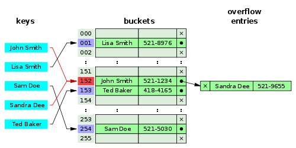

# Data Structure

## Structures

### Arrays

Implement an automatically resizing array.

Once the array is full, an increased array will be allocted and fill with previous one. So that the complexity of ```add``` in array is not **O(1)** but **O(1) amortized**.

### Linked Lists

Elements are connected with pointer. The previous element includes a pointer that points to the next element's address.

### Stack

Implementation of Last in First out, including two operations:

* Push: add element into collection
* Pop: remove the most recently added elements

### Queue

Fist in First out. Linkedlist can be used as an implementation

### Hash Table (Hash Map)

A structure that can map keys to values. A hash table uses a hash function to compute an index into an array of buckets or slots, frol which the desired value can be found.

#### Collisions

Collisions happen when the hash functions generates the same index for more than one key.

Resolutions:
* Seperate chaining
    * The first record is stored in the slot array itself. the following records will be stored somewhere else and pointed by first record.



* Open addressing
    * Open addressing refers to the fact that the address of item is not determined by its hash value
    * All records are stored in buckets it self
    * Starting with the hashed-to slot and proceeding in some probe sequence.


### Binary Tree

In binary tree each node has **at most** two children.

**NOT All binary trees are binary search trees (BST)**

#### Traversal

* In-Order: Left => Root => Right
* Pre-Order: Root => Left => Right
* Post-Order: Left => Right => Root

### Binary Search Tree

Also called **ordered** or **sorted binary trees**. BST is a binary tree whihc has the following properties:

* The left subtree contains only nodes lesser than root.
* The right subtree contains only nodes greater than root.
* The left and right subtree each must be a BST.
* In normal case, duplicates are excluded.
#### Self-balancing binary search tree

Also height-balanced binary search tree. It is a node-based binary search tree that automatically keeps its height small.

#### Operations

* Searching
* Insertion
* Deletion
* Traversal
* Verification

## Complextity

### List

|                      	| Add            	| Remove 	| Get  	| Contains 	|
|----------------------	|----------------	|--------	|------	|----------	|
| ArrayList            	| O(1) amortized 	| O(n)   	| O(1) 	| O(n)     	|
| LinkedList           	| O(1)           	| O(1)   	| O(n) 	| O(n)     	|
| CopyonWriteArrayList 	| O(n)           	| O(n)   	| O(1) 	| O(n)     	|

### Set

### Binary Tree

Binary Search Tree

| Algorithm 	| Average  	| Worst Case 	|
|-----------	|----------	|------------	|
| Space     	| O(n)     	| O(n)       	|
| Search    	| O(log n) 	| O(n)       	|
| Insert    	| O(logn)  	| O(n)       	|
| Delete    	| O(log n) 	| O(n)       	|